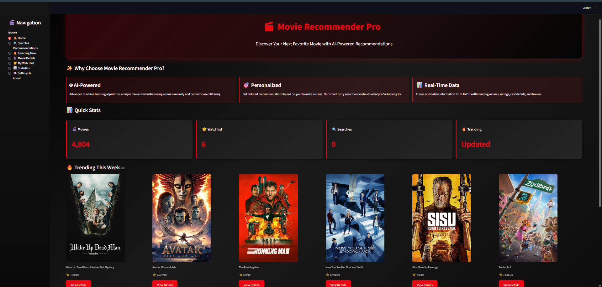
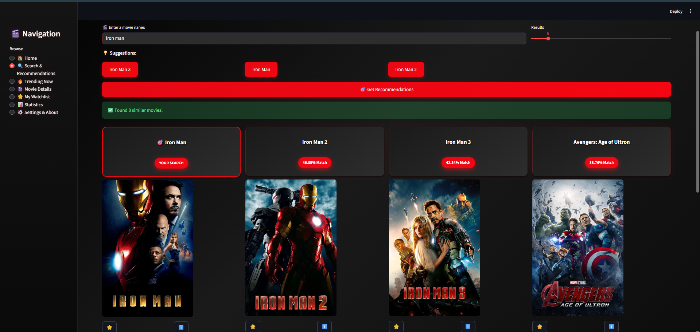
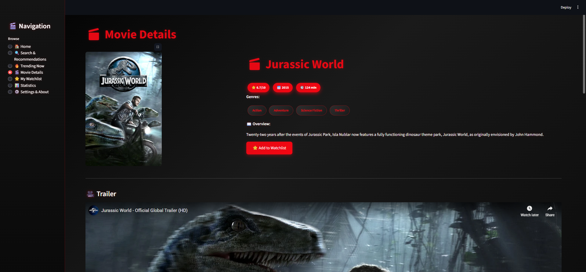
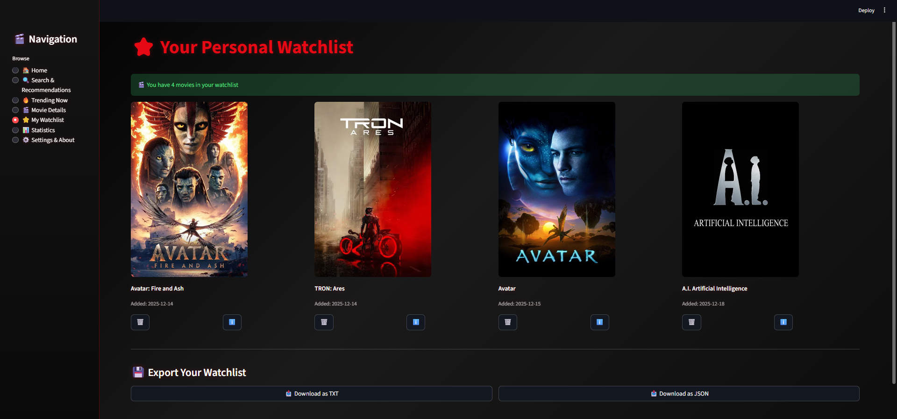

# 🎬 Movie Recommender System v3.0

<div align="center">


**An AI-Powered Movie Recommendation System that suggests the best movies based on your preferences**

[Live Demo](https://ai-powered-movie-recommender-system-gujjmxpslzqqlvypgiju7v.streamlit.app/) • [Features](#-features) • [Installation](#-installation) • [Usage](#-usage) • [Screenshots](#-screenshots)

</div>

---

## 📖 Table of Contents

- [Introduction](#-introduction)
- [Features](#-features)
- [Tech Stack](#️-tech-stack)
- [Installation](#-installation)
- [Configuration](#️-configuration)
- [Usage](#-usage)
- [How It Works](#-how-it-works)
- [Project Structure](#-project-structure)
- [API Reference](#-api-reference)
- [Screenshots](#-screenshots)
- [Contributing](#-contributing)
- [Future Enhancements](#-future-enhancements)
- [Contact](#-contact)

---

## 🎯 Introduction

**Movie Recommender System** is an advanced AI-powered web application that provides personalized movie recommendations using machine learning algorithms. The system fetches real-time data from TMDB (The Movie Database) API and uses content-based filtering with cosine similarity to deliver the best suggestions.

### 🌟 Why Choose This System?

- ✅ **5000+ Movies** in the extensive database
- ✅ **AI-Powered Recommendations** - Cosine similarity algorithm
- ✅ **Real-time Data** - TMDB API integration
- ✅ **Smart Fuzzy Search** - Understands typos and variations
- ✅ **Beautiful UI** - Netflix-inspired dark theme
- ✅ **Watchlist Management** - Save your favorite movies
- ✅ **Trending Movies** - Weekly trending content
- ✅ **Detailed Information** - Trailers, cast, ratings, and more

---

## ✨ Features

### 🔍 Core Features

| Feature | Description |
|---------|-------------|
| **Smart Search** | Fuzzy search algorithm that understands typos and variations |
| **AI Recommendations** | Machine learning based similarity scoring (0-100%) |
| **Movie Details** | Complete information: ratings, cast, crew, trailers |
| **Watchlist** | Save and manage your favorite movies |
| **Trending Movies** | Daily and weekly trending content |
| **Autocomplete** | Real-time search suggestions |
| **Responsive Design** | Mobile and desktop friendly |

### 🎨 UI Features

- 🌙 **Dark Theme** - Red And Black-inspired design
- 🎭 **Animated Cards** - Smooth hover effects
- 📱 **Responsive Layout** - Works on all devices
- 🎨 **Custom Styling** - Beautiful gradient backgrounds
- ⚡ **Fast Loading** - Cached data for better performance

### 📊 Advanced Features

- **Similarity Scoring**: 0-100% match percentage
- **Multi-source Search**: Local database + TMDB API
- **Error Handling**: Retry logic and fallback mechanisms
- **Search History**: Track your searches
- **Genre Tags**: Filter by genres
- **Cast Information**: Top cast members with photos
- **Similar Movies**: Discover related content

---

## 🛠️ Tech Stack

### Backend
- **Python 3.8+**
- **Pandas** - Data manipulation
- **NumPy** - Numerical computing
- **Scikit-learn** - Machine learning (CountVectorizer, Cosine Similarity)
- **Pickle** - Data serialization

### Frontend
- **Streamlit** - Web framework
- **HTML/CSS** - Custom styling
- **JavaScript** - Interactive components

### APIs & Data
- **TMDB API** - Movie data, posters, trailers
- **FuzzyWuzzy** - Fuzzy string matching
- **Python-Levenshtein** - String similarity

### ML Algorithm
```
Content-Based Filtering
    ↓
CountVectorizer (5000 features)
    ↓
Cosine Similarity Matrix
    ↓
Sorted Recommendations
```

---

## 📦 Installation

### Prerequisites

```bash
# Python 3.8 or higher
python --version

# pip package manager
pip --version
```

### Step 1: Clone Repository

```bash
git clone https://github.com/yourusername/movie-recommender-system.git
cd movie-recommender-system
```

### Step 2: Create Virtual Environment (Optional but Recommended)

```bash
# Windows
python -m venv venv
venv\Scripts\activate

# Linux/Mac
python3 -m venv venv
source venv/bin/activate
```

### Step 3: Install Dependencies

```bash
pip install -r requirements.txt
```

**requirements.txt:**
```
streamlit==1.28.0
pandas==2.0.3
numpy==1.24.3
scikit-learn==1.3.0
requests==2.31.0
python-fuzzywuzzy==0.18.0
python-Levenshtein==0.21.1
```

### Step 4: Download Dataset

Place the dataset files in the project directory:

| File | Size | Description |
|------|------|-------------|
| `tmdb_5000_movies.csv` | ~5.7 MB | Movie metadata |
| `tmdb_5000_credits.csv` | ~40 MB | Cast and crew information |

**Download Link**: [TMDB 5000 Movies Dataset](https://www.kaggle.com/datasets/tmdb/tmdb-movie-metadata)

### Step 5: Preprocess Data

```bash
python data_preprocessing_fixed.py
```

This script will generate:
- `movie_dict.pkl` (~2.7 MB) - Processed movie data
- `similarity.pkl` (~XXX MB) - Similarity matrix

**Processing time**: 2-5 minutes (depends on your system)

### Step 6: Get TMDB API Key

1. Create an account on [TMDB website](https://www.themoviedb.org/)
2. Go to Settings → API → Create API key
3. Copy the API key
4. Update the API_KEY in `app.py`:

```python
class Config:
    API_KEY = "your_api_key_here"
```

Or use environment variable:
```bash
export TMDB_API_KEY="your_api_key_here"
```

### Step 7: Run Application

```bash
streamlit run app.py
```

The application will open at: `http://localhost:8501`

---

## ⚙️ Configuration

### Config Class in `app.py`

```python
class Config:
    API_KEY = "your_tmdb_api_key"           # TMDB API key
    BASE_URL = "https://api.themoviedb.org/3"
    IMAGE_BASE = "https://image.tmdb.org/t/p/w500"
    PLACEHOLDER = "https://via.placeholder.com/300x450"
    CACHE_TIME = 3600                        # 1 hour cache
    REQUEST_TIMEOUT = 15                     # 15 seconds
    MAX_RETRIES = 3                          # 3 retry attempts
```

### Customization Options

**Search Settings:**
```python
# Fuzzy search threshold (0-100)
fuzzy_search_movie(query, movies, threshold=60)

# Number of recommendations
num_recommendations = st.slider("# Results", 6, 24, 15)
```

**UI Theme:**
Edit the `apply_custom_css()` function to customize CSS.

---

## 🎮 Usage

### 1. **Home Page** 🏠

- View trending movies
- Quick statistics
- Features overview
- Quick search bar

### 2. **Search & Recommendations** 🔍

```
1. Type a movie name (e.g., "Avatar")
2. Select from autocomplete suggestions
3. Choose number of results (6-24)
4. Click "Get Recommendations"
5. View similar movies with similarity scores
```

**Example Searches:**
- "Avatar" → Sci-fi adventures
- "The Dark Knight" → Action thrillers
- "Inception" → Mind-bending movies

### 3. **Movie Details** 🎬

Click **"View Details"** to see complete information about a selected movie:

- High-resolution poster
- Rating, release year, and runtime
- Genres
- Plot overview
- Trailer (if available)
- Top cast members with photos
- Similar movie recommendations

The UI follows a **Netflix-inspired dark theme** with smooth hover animations for a premium viewing experience.

---

### 📺 Watch Platforms (OTT Availability)

The **Movie Details** page includes a dedicated **“Available On”** section that shows where a movie can be streamed online on popular OTT platforms.

#### 🔹 How It Works

The application uses **TMDB (The Movie Database) – Watch Providers API** to fetch **real-time streaming availability**.

- Availability is **region-specific** and currently configured for **India (IN)**
- Supported platforms include:
  - Netflix
  - Amazon Prime Video
  - JioHotstar
  - Disney+
  - Apple TV
  - Google Play Movies (when available)

#### 🔹 User Experience

Each OTT platform is displayed as a **capsule-style button** featuring:
- Platform logo
- Platform name

The capsules are **clickable** and redirect users to the official streaming page of the movie.

**Example:**

#### 🔹 Smart Fallback Handling

- If a movie is not available on any OTT platform in the selected region, the app clearly displays:
  > 📭 Currently not available on OTT platforms in India

- If a platform logo is missing from the API response, a **placeholder icon** is shown to maintain UI consistency.

#### 🔹 Technical Implementation

**API Endpoint Used:**

- Watch provider data is cached using **Streamlit caching** to:
  - Reduce unnecessary API calls
  - Improve overall performance
- This feature is fully integrated inside the `display_movie_details()` function in `app.py`

#### 🔹 Why This Feature Matters

- Helps users instantly decide **where to watch a movie**
- Eliminates the need to manually search across multiple OTT platforms
- Makes the application more **practical, real-world ready, and industry-grade**

#### 🔹 Key Highlights

✅ Real-time OTT availability  
✅ Region-based results (India)  
✅ Clickable streaming links  
✅ Clean capsule-style UI  
✅ Graceful fallback handling

### 4. **Watchlist** ⭐

```
Add to Watchlist → Click ⭐ button
View Watchlist → Select "⭐ My Watchlist" in sidebar
Remove → Click "Remove" button in watchlist
```

### 5. **Trending** 🔥

- Weekly trending movies
- Clickable posters
- Real-time TMDB data

### 6. **Statistics** 📊

- Total movies in database
- Genres count
- Year range
- Average ratings

---

## 🔬 How It Works?

### Content-Based Filtering Algorithm


### Step-by-Step Process

#### 1. **Data Preprocessing**

```python
# Features extracted:
- Overview (plot description)
- Genres (Action, Comedy, etc.)
- Keywords (space, alien, future)
- Cast (top 3 actors)
- Director (from crew)

# Combined into "tags" column
tags = overview + genres + keywords + cast + director
```

#### 2. **Vectorization**

```python
from sklearn.feature_extraction.text import CountVectorizer

cv = CountVectorizer(max_features=5000, stop_words='english')
vectors = cv.fit_transform(movies['tags'])
```

**Output**: 5000-dimensional vector for each movie

#### 3. **Similarity Calculation**

```python
from sklearn.metrics.pairwise import cosine_similarity

similarity_matrix = cosine_similarity(vectors)
```

**Formula**:
```
Similarity(A, B) = (A · B) / (||A|| × ||B||)

Where:
- A · B = Dot product of vectors A and B
- ||A|| = Magnitude of vector A
- ||B|| = Magnitude of vector B
```

**Result**: Matrix where similarity[i][j] = similarity between movie i and j

**Value Range**: 0 to 1 (or 0% to 100%)
- 0 = Completely different
- 1 = Identical

#### 4. **Recommendation Generation**

```python
def recommend(movie, n=15):
    # Get movie index
    idx = find_movie_index(movie)
    
    # Get similarity scores
    scores = list(enumerate(similarity[idx]))
    
    # Sort by similarity (descending)
    scores = sorted(scores, key=lambda x: x[1], reverse=True)
    
    # Return top N
    return scores[1:n+1]  # Skip first (same movie)
```

### Fuzzy Search Algorithm

Handles typos and variations:

```python
"Avtar" → "Avatar" ✅
"Dark Night" → "The Dark Knight" ✅
"incepton" → "Inception" ✅
```

**Matching Strategy**:
1. **Exact match** - Fastest, perfect match
2. **Partial match** - Contains the query string
3. **Fuzzy ratio** - Levenshtein distance based similarity

**Example**:
```python
query = "Avtar"
threshold = 60  # Minimum similarity score

# Calculate similarity score
score = fuzz.ratio("Avtar", "Avatar")  # Returns: 91

if score >= threshold:
    return "Avatar"  # Match found!
```

---

## 📁 Project Structure

```
movie-recommender-system/
│
├── app.py                          # Main Streamlit application (13K+ lines)
├── data_preprocessing_fixed.py     # Data preprocessing script
├── requirements.txt                # Python dependencies
│
├── tmdb_5000_movies.csv           # Raw movie data (5.7 MB)
├── tmdb_5000_credits.csv          # Cast and crew data (40 MB)
│
├── movie_dict.pkl                 # Processed movie dictionary (2.7 MB)
├── similarity.pkl                 # Similarity matrix (Auto-generated)
│
├── watchlist_default.json         # User watchlist data
│
├── README.md                      # Documentation
├── .gitignore                     # Git ignore file
└── LICENSE                        # MIT License
```

### File Descriptions

| File | Purpose | Size | Required |
|------|---------|------|----------|
| `app.py` | Main application | 59 KB | ✅ Yes |
| `data_preprocessing_fixed.py` | Data preprocessing | 12 KB | ✅ Yes |
| `requirements.txt` | Dependencies list | 136 B | ✅ Yes |
| `movie_dict.pkl` | Processed movie data | 2.7 MB | ✅ Yes |
| `similarity.pkl` | Similarity matrix | Varies | ✅ Yes |
| `tmdb_5000_movies.csv` | Original dataset | 5.7 MB | ⚠️ For preprocessing |
| `tmdb_5000_credits.csv` | Credits data | 40 MB | ⚠️ For preprocessing |
| `watchlist_default.json` | Watchlist storage | <1 KB | Auto-created |

---

## 🔌 API Reference

### TMDB API Endpoints Used

#### 1. Movie Details
```http
GET /movie/{movie_id}
```

**Parameters:**
- `api_key` (required): Your TMDB API key
- `append_to_response` (optional): `videos,credits,similar,reviews`

**Response:**
```json
{
  "id": 19995,
  "title": "Avatar",
  "vote_average": 7.9,
  "release_date": "2009-12-10",
  "runtime": 162,
  "genres": [...],
  "overview": "...",
  "videos": {...},
  "credits": {...}
}
```

#### 2. Trending Movies
```http
GET /trending/movie/{time_window}
```

**Parameters:**
- `api_key` (required): Your API key
- `time_window` (required): `day` or `week`
- `page` (optional): Page number (default: 1)

**Response:**
```json
{
  "results": [
    {
      "id": 19995,
      "title": "Avatar",
      "poster_path": "/path.jpg",
      "vote_average": 7.9
    }
  ]
}
```

#### 3. Search Movies
```http
GET /search/movie
```

**Parameters:**
- `api_key` (required): Your API key
- `query` (required): Search term

**Response:**
```json
{
  "results": [
    {
      "id": 19995,
      "title": "Avatar",
      "poster_path": "/path.jpg"
    }
  ]
}
```

### Internal Functions

#### Search & Recommendations

**`recommend(movie_name, movies, similarity, n=15)`**
```python
"""
Generate movie recommendations based on similarity

Args:
    movie_name (str): Title of the movie
    movies (DataFrame): All movies data
    similarity (ndarray): Similarity matrix
    n (int): Number of recommendations (default: 15)

Returns:
    tuple: (recommendations_list, posters_list, error_message)
"""
```

**`fuzzy_search_movie(query, movies, threshold=60)`**
```python
"""
Find best matching movie using fuzzy string matching

Args:
    query (str): Movie title to search
    movies (DataFrame): All movies data
    threshold (int): Minimum similarity score (0-100)

Returns:
    tuple: (movie_index, matched_title) or (None, None)
"""
```

**`get_movie_suggestions(query, movies, limit=10)`**
```python
"""
Get autocomplete suggestions for search

Args:
    query (str): Partial movie title
    movies (DataFrame): All movies data
    limit (int): Maximum suggestions

Returns:
    list: List of matching movie titles
"""
```

#### API Functions

**`fetch_movie_details(movie_id)`**
```python
"""
Fetch complete movie details from TMDB

Args:
    movie_id (int): TMDB movie ID

Returns:
    dict: Complete movie data or None on error
"""
```

**`fetch_poster(movie_id)`**
```python
"""
Fetch movie poster URL

Args:
    movie_id (int): TMDB movie ID

Returns:
    str: Poster URL or placeholder image
"""
```

**`get_trending(time_window='week', page=1)`**
```python
"""
Fetch trending movies from TMDB

Args:
    time_window (str): 'day' or 'week'
    page (int): Page number

Returns:
    list: List of up to 12 trending movies
"""
```

#### Watchlist Functions

**`add_to_watchlist(movie_title, movie_id)`**
```python
"""
Add movie to user's watchlist

Args:
    movie_title (str): Movie title
    movie_id (int): TMDB movie ID

Returns:
    bool: True if added, False if already exists
"""
```

**`remove_from_watchlist(index)`**
```python
"""
Remove movie from watchlist

Args:
    index (int): List index to remove

Returns:
    bool: True if removed successfully
"""
```

**`load_watchlist(user_id='default')`**
```python
"""
Load user's watchlist from JSON file

Args:
    user_id (str): User identifier

Returns:
    list: List of watchlist items
"""
```

---

## 📸 Screenshots

### 🏠 Home Page



### 🔍 Search & Recommendations



### 🎬 Movie Details Page


### ⭐ Watchlist Page



## 🤝 Contributing

Contributions are welcome! Please follow these steps:

### How to Contribute

1. **Fork the Repository**
```bash
git clone https://github.com/yourusername/movie-recommender-system.git
```

2. **Create Feature Branch**
```bash
git checkout -b feature/AmazingFeature
```

3. **Make Changes**
- Write clean, readable code
- Add tests if applicable
- Update documentation

4. **Commit Changes**
```bash
git commit -m "Add: Amazing new feature"
```

5. **Push to Branch**
```bash
git push origin feature/AmazingFeature
```

6. **Open Pull Request**
- Provide clear description
- Add screenshots (if applicable)
- Reference any related issues

### Contribution Guidelines

- ✅ Write clean and readable code
- ✅ Add meaningful comments
- ✅ Implement error handling
- ✅ Test before submitting
- ✅ Update README if needed
- ✅ Follow PEP 8 style guide for Python
- ✅ Use descriptive commit messages

### Code Style

```python
# Good ✅
def fetch_movie_details(movie_id):
    """
    Fetch complete details for a specific movie
    
    Args:
        movie_id: TMDB movie ID
        
    Returns:
        dict: Movie details or None
    """
    try:
        response = make_api_request(url, params)
        return response
    except Exception as e:
        logger.error(f"Error: {e}")
        return None

# Bad ❌
def f(x):
    r = requests.get(url + str(x))
    return r.json()
```

### Bug Reports

To report a bug:
1. Go to GitHub Issues
2. Provide clear title
3. Describe steps to reproduce
4. Expected vs Actual behavior
5. Screenshots (if applicable)
6. System information (OS, Python version)

### Feature Requests

To request a feature:
1. Check existing issues first
2. Clearly describe the feature
3. Explain the use case
4. Provide examples if possible

---

## 🚀 Future Enhancements

### Planned Features

#### Phase 1 - User Experience
- [ ] **User Authentication** - Personal accounts with login/signup
- [ ] **Rating System** - Allow users to rate movies
- [ ] **Review System** - Write and read movie reviews
- [ ] **Dark/Light Theme Toggle** - User preference
- [ ] **Multi-language Support** - Hindi, Spanish, French, etc.
- [ ] **Advanced Filters** - Filter by genre, year, rating, language
- [ ] **Sort Options** - Sort by popularity, rating, release date

#### Phase 2 - Enhanced Recommendations
- [ ] **Collaborative Filtering** - User-based recommendations
- [ ] **Hybrid System** - Combine content + collaborative filtering
- [ ] **Mood-based Recommendations** - Happy, sad, thriller, comedy
- [ ] **Actor/Director Search** - Find movies by person
- [ ] **Personalized Home Page** - Based on watch history
- [ ] **Movie Comparison** - Side-by-side comparison

#### Phase 3 - Social Features
- [ ] **Share Watchlists** - Share with friends
- [ ] **Follow Users** - See what others are watching
- [ ] **Discussion Forums** - Movie discussions
- [ ] **Watch Parties** - Virtual watch together
- [ ] **Social Login** - Google, Facebook login

#### Phase 4 - Analytics & Insights
- [ ] **Viewing Statistics** - Personal analytics dashboard
- [ ] **Recommendation History** - Track past recommendations
- [ ] **Trending Analytics** - What's popular in your region
- [ ] **Genre Preferences** - Visualize your taste
- [ ] **Watch Time Tracking** - Time spent watching

#### Phase 5 - Technical Improvements
- [ ] **Database Integration** - PostgreSQL/MongoDB
- [ ] **Caching Layer** - Redis for faster responses
- [ ] **API Optimization** - Reduce API calls
- [ ] **Docker Support** - Easy deployment
- [ ] **CI/CD Pipeline** - Automated testing & deployment
- [ ] **Unit Tests** - 80%+ code coverage
- [ ] **Performance Monitoring** - Application insights
- [ ] **Mobile App** - React Native version
- [ ] **Progressive Web App** - Offline support
- [ ] **Microservices Architecture** - Scalable backend

### Technical Debt

- [ ] Refactor large functions into smaller modules
- [ ] Implement logging framework
- [ ] Add comprehensive error handling
- [ ] Optimize similarity matrix storage (use sparse matrices)
- [ ] Implement rate limiting for API calls
- [ ] Add input validation and sanitization
- [ ] Improve code documentation
- [ ] Add type hints throughout codebase

## 📞 Contact

### Developer Information

**Your Name**
- 🐙 GitHub: [Sumersingpatil2694](https://github.com/Sumersingpatil2694)
- 💼 LinkedIn: [Sumersing Patil] (linkedin.com/in/sumersing-patil-839674234)
- 📧 Email: sumerrajput0193@gmail.com
- 🐦 Twitter: [X](https://x.com/SumerRajput2694)

### Project Links

- **Repository**: [https://github.com/yourusername/movie-recommender-system](https://github.com/yourusername/movie-recommender-system)
- **Issues**: [Report a Bug](https://github.com/yourusername/movie-recommender-system/issues)
- **Discussions**: [Join Discussion](https://github.com/yourusername/movie-recommender-system/discussions)
- **Wiki**: [Documentation](https://github.com/yourusername/movie-recommender-system/wiki)

---

## 🙏 Acknowledgments

### Credits & Thanks

- **TMDB** - For providing the excellent API and movie data
- **Kaggle** - For hosting the dataset
- **Streamlit** - For the amazing web framework
- **Scikit-learn** - For machine learning tools
- **Python Community** - For incredible open-source libraries

### Resources & References

- [TMDB API Documentation](https://developers.themoviedb.org/3)
- [Streamlit Documentation](https://docs.streamlit.io)
- [Scikit-learn Documentation](https://scikit-learn.org)
- [Content-Based Filtering Guide](https://towardsdatascience.com/content-based-filtering)
- [Cosine Similarity Explained](https://www.machinelearningplus.com/nlp/cosine-similarity/)

### Inspiration

This project was inspired by:
- Netflix recommendation system
- Amazon Prime Video
- IMDb
- Rotten Tomatoes

---

---

## ❓ FAQ

**Q: How do I get a TMDB API key?**  
A: Create an account on the TMDB website, go to Settings → API, and generate an API key. It's free for non-commercial use.

**Q: Why is the similarity.pkl file so large?**  
A: This is normal. The similarity matrix contains similarity scores between all movie pairs. You can use sparse matrices to reduce size:
```python
from scipy.sparse import csr_matrix, save_npz
similarity_sparse = csr_matrix(similarity)
save_npz('similarity_sparse.npz', similarity_sparse)
```

**Q: How do I update the movie database?**  
A: Download a new dataset from Kaggle and run the preprocessing script again:
```bash
python data_preprocessing_fixed.py
```

**Q: I'm getting "API rate limit exceeded" errors. What should I do?**  
A: Increase the `CACHE_TIME` in the Config class or implement request throttling. TMDB has rate limits of 40 requests per 10 seconds for free accounts.

**Q: Can I deploy this on Heroku/AWS/Azure?**  
A: Yes! The application works on most cloud platforms. You'll need to:
1. Configure environment variables
2. Ensure pickle files are included
3. Set up proper resource limits

**Q: The recommendations aren't accurate. How can I improve them?**  
A: Try these approaches:
- Adjust the fuzzy search threshold
- Add more features (country, language, budget)
- Increase `max_features` in CountVectorizer
- Implement collaborative filtering
- Fine-tune preprocessing

**Q: How much memory does the application need?**  
A: Minimum 2GB RAM recommended. The similarity matrix can be memory-intensive for large datasets.

**Q: Why are some posters not loading?**  
A: This could be due to:
- Network issues
- Missing poster_path in TMDB data
- Incorrect IMAGE_BASE URL
- The placeholder image will be shown in such cases

**Q: How do I add more movies to the database?**  
A: You'll need to:
1. Append new movies to the CSV files
2. Run preprocessing script again
3. Replace the pickle files

**Q: Is the application mobile-friendly?**  
A: Yes! The UI is responsive and works on mobile devices, though the experience is optimized for desktop.

---

## 🎓 Learning Resources

### For Beginners

- [Python for Data Science](https://www.coursera.org/learn/python-for-data-science)
- [Machine Learning Basics](https://www.coursera.org/learn/machine-learning)
- [Streamlit Tutorial](https://docs.streamlit.io/library/get-started)

### Advanced Topics

- [Recommendation Systems](https://www.coursera.org/learn/recommender-systems)
- [Natural Language Processing](https://www.coursera.org/learn/natural-language-processing)
- [Deep Learning Specialization](https://www.coursera.org/specializations/deep-learning)

---

<div align="center">

### ⭐ If you found this project helpful, please give it a star! ⭐

**Made with ❤️ and Python**

[⬆ Back to Top](#-movie-recommender-system-v30)

---

**Keywords**: movie recommendation, machine learning, content-based filtering, cosine similarity, streamlit, python, tmdb api, data science, artificial intelligence, movie search

</div>
